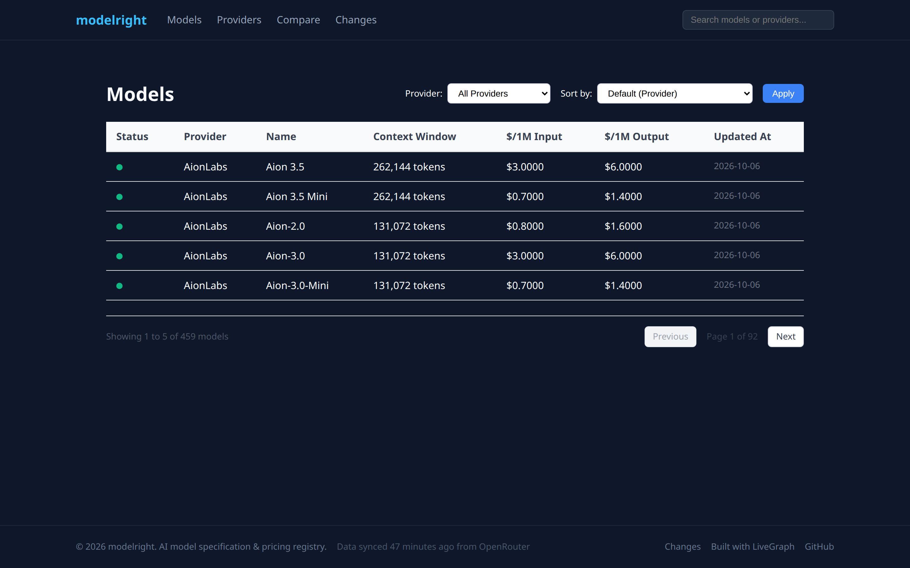

# modelright

**Live registry of AI model specs, context windows, and per-1M-token pricing — running at [modelright.dev](https://modelright.dev).**

A Next.js + Postgres app that keeps a real, current catalog of LLMs: the OpenRouter catalog is synced hourly, Artificial Analysis enriches models with benchmark and speed data, and every price change lands in an append-only snapshot log that powers the changes feed and price-history charts.



## What's in it

- **Catalog** — `/models` searchable/filterable by provider, status, price ceiling, context floor, modality, and free-tier; `/providers` directory
- **Model detail** — specs, pricing, price-history chart, cost calculator, Artificial Analysis benchmark card (`/models/[provider]/[slug]`)
- **Compare** — up to 4 models side-by-side with an interactive picker and cheapest-highlighting (`/compare`); SEO-friendly pair pages at `/compare/a-vs-b`
- **Task picks** — `/pick` and `/pick/{chat,coding,long-context,vision,cheap-bulk}` rank models by an explicit rule written on the page
- **Changes feed** — `/changes` lists recent price/status changes and model additions/removals, with an RSS feed
- **Public API** — `GET /api/v1/models` (same filters as the UI), `/api/v1/models/{provider}/{slug}`, `/api/v1/providers`, `/api/v1/changes`; OpenAPI at `/openapi.json`
- **MCP server** — Streamable-HTTP endpoint at `/api/mcp` (also `/.well-known/mcp`) with six read tools (`search_models`, `get_model`, `list_providers`, `compare_models`, `get_changes`, `get_ingest_status`)
- **Agent surfaces** — `/llms.txt`, `/agents.txt`, A2A agent card (`/.well-known/agent-card.json`), Smithery server card (`/.well-known/mcp/server-card.json`), `server.json` MCP-registry listing
- **Analytics** — cookieless page-view beacon (daily-rotating salted visitor hash, no raw IPs), edge-middleware AI-crawler tracking (`/api/bot-hit`), and MCP call logging, all rendered on a token-gated `/admin` + `/admin/analytics`
- **Ingest pipeline** — `POST /api/ingest` (Bearer token, zod-validated, idempotent upsert) and `POST /api/cron/sync` (hourly OpenRouter + AA sync, marks removed models rather than deleting)

## Stack

- **Next.js 14** (App Router, edge middleware) + **React 18** + **TypeScript**
- **Drizzle ORM** over **PostgreSQL** (`postgres` driver) — migrations in `drizzle/`
- **mcp-handler** for the MCP Streamable-HTTP transport
- **Vitest + happy-dom** — 200+ tests, ~90% line coverage on `src/lib` + `src/app/api`

## Setup

```bash
npm install
cp .env.example .env   # set DATABASE_URL
npm run db:migrate
npm run db:seed        # optional fixture data so pages render pre-ingest
npm run dev            # http://localhost:3000
```

### Scripts

| Script | Purpose |
|--------|---------|
| `npm run dev` / `build` / `start` | Next.js lifecycle |
| `npm run typecheck` | `tsc --noEmit` |
| `npm run test` | Vitest with coverage |
| `npm run db:generate` / `db:migrate` / `db:seed` | Drizzle schema lifecycle + fixtures |

### Environment

See `.env.example`. Highlights: `DATABASE_URL` (required), `INGEST_TOKEN` + `CRON_SECRET` (write-path auth), `AA_API_KEY` (Artificial Analysis enrichment), `ADMIN_TOKEN` (gates `/admin`), `ANALYTICS_SALT` (daily visitor-hash salt — rotate to reset identities).

## Built autonomously

This repo is maintained by a [LiveGraph](https://livegraph.ai) improvement loop: queued items in `QUEUE.md` are picked up, implemented, tested, and merged by agents. `PLAN.md` holds the product roadmap, `docs/loop-reports/` is the per-item delivery log, and `GROWTH.md`/`growth/assets/` hold the distribution plan and media kit (including a walkthrough video). If you're evaluating agent-driven development, the queue history and loop reports are the interesting part.

## License

MIT — see [LICENSE](LICENSE).
